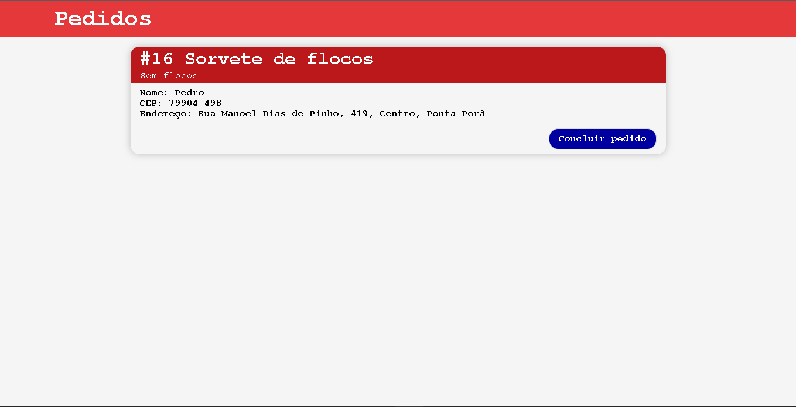

# Gerenciador-De-Pedidos
#### Gerenciador de pedidos para lojas online.
#### Quando o cliente confirmar o pedido, chegara no site com as informações.
#### Bom para organização da equipe.

<br>

## Índice
* [Midia](#midia)
* [Tecnologias](#tecnologias)
* [Como usar](#como-usar) 

<br><br>

## 📷 Midia




<br><br>

## 🔧 Tecnologias
1. MYSQL
2. EXPRESS
3. SOCKET.IO

<br><br>

## 🏁 Como usar

1. Clone esse repositorio
2. Entre na pasta do projeto
3. Configure o acesso ao seu mysql no arquivo ```db.js```
4. Use ``` node app.js ```

